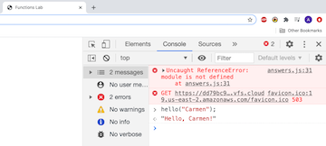
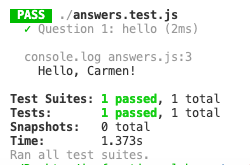

# Simple Functions Lab

This lab aims to give you more practice writing functions and solving problems.

## Instructions

As you're writing your functions, it's important to code a little and test a little. It's easier to fix a few bugs at a time than to have to fix a ton of bugs at the end. There are three ways in which you can test your code.

    * Using the browser
    * Using `node`
    * Using the automatic test cases your instructors have provided

## Question 1 Walkthrough

Code along as we show you how to solve Question 1. Write a function that takes a name and **returns** a greeting with `"Hello"` and the person's name.

Example:
```javascript
hello("Carmen"); // "Hello, Carmen!"
```

In your code, write:
```javascript
function hello(name) {
  return `Hello, ${name}!`;
}
```

### Testing using the Browser

To test your code using the browser, open your `index.html` in a new tab. Because your HTML has a `<script>` tag to your JavaScript file, they are linked together. Open the console in your HTML webpage (you can ignore the error about `module is not defined` and the error about `Failed to load resource`) and *invoke* the function to verify it has the expected output.



### Testing using node

You can run JavaScript outside the browser using the command `node <path_to_file>`. From your terminal, you must be in the project folder where `answers.js` is located. Then you can run the file from the terminal with `node answers.js`. 

**However, this will not print anything out yet!**

Although we have written our function, we have never *invoked* it! We were able to invoke functions using the browser's console, but we can't invoke functions using the terminal. Instead, we must *invoke the function* in the file itself, and then run the file. Update your code in `answers.js` to *invoke* the function:

```javascript
hello("Carmen"); // Remember hoisting is a thing ;)

// Question 1
function hello(name) {
  return `Hello, ${name}!`;
}
```

*Save your file.* Now if we go back to your terminal and run `nodes answer.js`, we get... still nothing...

Although we have invoked the function in our file, we never tell our program to *do anything* with our function's **return value**. When you invoke a function via the browser console, it will display the *return value*. When you run a JavaScript file using node, it treats the function's return value like any other data. Let's make a change to *print* out the return value of our function:

```javascript
console.log( hello("Carmen") ); 

// Question 1
function hello(name) {
  return `Hello, ${name}!`;
}
```

*Save your file.* Now run `node answers.js` from the terminal to see the expected output.

### Testing using Automated Test Cases

Your instructors have written some test cases in the file `answers.text.js`. DO NOT change anything in this file. These tests cases are very similar to the test cases you might have seen on CodeWars.

From the terminal run `npm install` to install dependencies. You only have to run this command once per lab/assignment.

Then run `npm test` to see the results.



## Coding Exercises

1. Write a function that takes a name and **returns** a greeting with `"Hello"` and the person's name.

    Example:
    ```javascript
    hello("Carmen"); // "Hello, Carmen!"
    hello("Devonte"); // "Hello, Devonte!"
    hello("Reuben Ogbonna"); // "Hello, Reuben Ogbonna!"
    ```

2. Write a function that **logs** all even numbers from 0 to 50, inclusive, to the console. Log all numbers on separate lines. Then, this function should **return** the string, `"Why is 6 afraid of 7?"`.

    Example:
    ```javascript
    logEvenNumbers();

    // 0
    // 2
    // 4
    .
    .
    .
    // 48
    // 50
    ```

3. Write a function that takes in two numbers and returns the product (multiple those numbers together):

    Examples:
    ```javascript
    findProduct(5, 7); // 35
    findProduct(15, 10); // 150
    findProduct(25.75, 42); // 1081.5
    ```

4. Write a function that returns the sum of all numbers between 1 and some other number, inclusive, that are multiples of 4 or 7. For example, if the supplied number is 17, the result should be 61 (4 + 7 + 8 + 12 + 14 + 16).

    You may assume that the number passed in is an integer greater than 1.

    Examples:
    ```javascript
    multisum(17); //(4 + 7 + 8 + 12 + 14 + 16) => 61
    multisum(21); //(4 + 7 + 8 + 12 + 14 + 16 + 20 + 21) => 102
    ```
    
5. Write a function that takes one argument, a positive integer, and returns a string of alternating `'X'`s and `'O'`s, always starting with a `'X'`. The length of the string should match the given integer.

    Examples:
    ```javascript
    stringy(6);    // "XOXOXO"
    stringy(9);    // "XOXOXOXOX"
    stringy(4);    // "XOXO"
    stringy(7);    // "XOXOXOX"
    ```

## Challenge functions:

There are no automated test cases for the following problems. You will be responsible for testing them yourselves manually, either using the browser or `node`.

1. Write a function `weirdString()` that takes in a string and returns a copy of that string with every vowel removed, and then of the remaining letters, every other letter alternates between lowercase and uppercase.

```javascript
weirdString("hello world") // "hLl wRlD"
weirdString("Reuben Ogbonna") // "rBn gBnN"
weirdStsring("Maya Bhattacharjee-Marcantonio") // "mY BhTtChRj-mRcNtNi"
```

2. Write a function `possibleSums()` that takes in an integer. It returns an array of all possible sums of every two digits combination within that number. 

For example, given the number `12345`, all possible sums of every two digit combination from that number are:

`[ 1 + 2, 1 + 3, 1 + 4, 1 + 5, 2 + 3, 2 + 4, 2 + 5, 3 + 4, 3 + 5, 4 + 5 ]`

So the function should return `[ 3, 4, 5, 6, 5, 6, 7, 7, 8, 9 ]`.